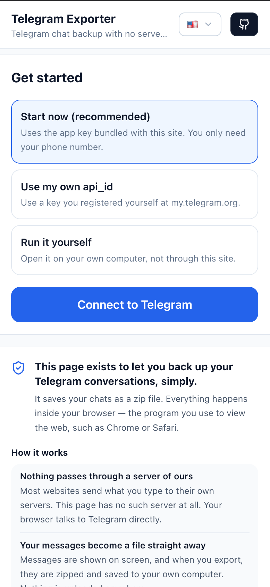
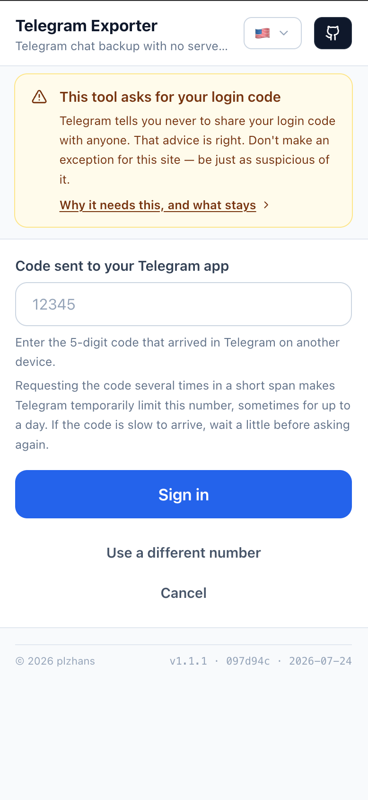
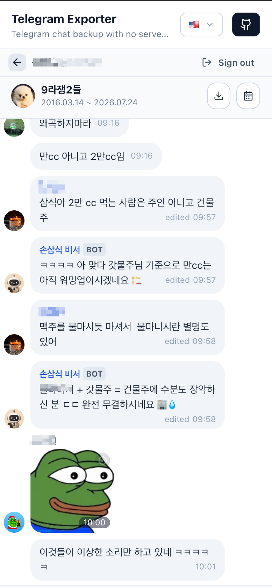
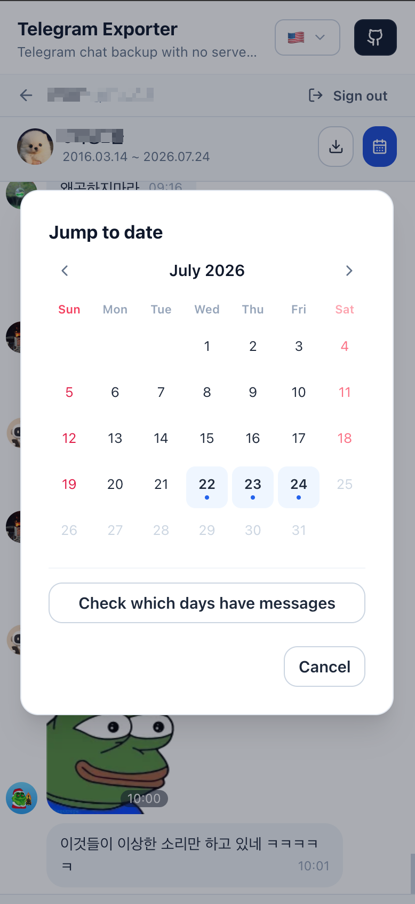
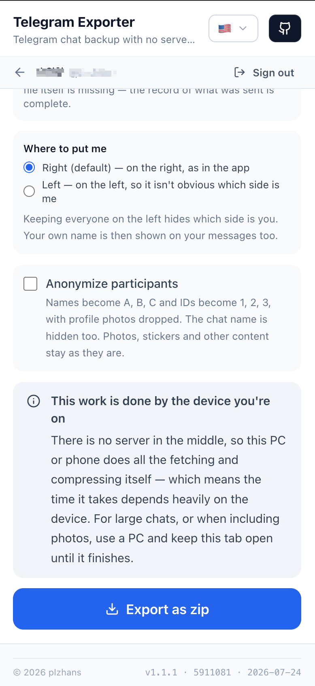
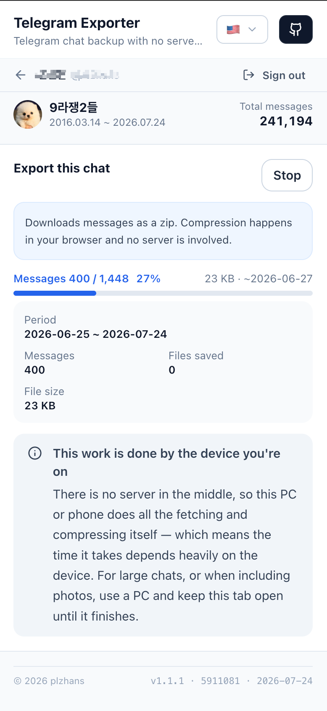

# Telegram Chat Exporter

[](https://telegram-exporter.plzhans.com)
[](https://github.com/plzhans/telegram-chat-exporter/releases)
[](https://github.com/plzhans/telegram-chat-exporter/releases/latest)

**텔레그램 대화를 통째로 내 컴퓨터에 저장합니다.**

브라우저에서 바로 동작합니다. 설치할 필요도, 가입할 필요도 없습니다. 전화번호와 대화 내용은
우리 서버를 거치지 않습니다 — 거쳐 갈 서버가 아예 없기 때문입니다.

### ▶ [앱 열기](https://telegram-exporter.plzhans.com/)

English: [README.md](README.md)

---

## 어떤 화면인가

|  |  |  |
| :---: | :---: | :---: |
|  |  |  |
|  |  |  |

## 무엇을 받게 되나

이 도구 없이도, 인터넷 없이도, 몇 년 뒤에도 열리는 zip 파일입니다.

| 파일 | 무엇인가 |
| --- | --- |
| `index.html` | 대화 모양 그대로 읽히는 문서. 압축을 풀면 이걸 먼저 엽니다. |
| `messages.jsonl` | 한 줄에 메시지 하나. 다시 기계로 읽기 위한 원본. |
| `messages.txt` | 사람이 읽는 형태, 오래된 것부터. |
| `meta.json` | 대화방 정보, 메시지 수, 내보낸 시각. |

사진과 스티커도 함께 담을 수 있습니다. **참여자 익명 처리**도 됩니다 — 이름은 A·B·C로,
회원번호는 1·2·3으로 바뀌어서 다른 사람에게 건네줄 수 있습니다.

## 두 가지 방법

**1. 사이트에서 바로** — [telegram-exporter.plzhans.com](https://telegram-exporter.plzhans.com/)

**2. 받아서 직접 실행** —
[zip 내려받기](https://github.com/plzhans/telegram-chat-exporter/releases/latest/download/telegram-exporter.zip)
후 압축을 풀고 `index.html`을 엽니다. 웹서버도, 설치도 필요 없습니다. 텔레그램에 연결해야
하므로 인터넷은 필요합니다.

## 믿지 마시고, 확인하세요

이 도구는 전화번호와 텔레그램 로그인 코드를 요구합니다. 텔레그램은 그 코드를 누구에게도
알려주지 말라고 안내하고, **그 원칙은 옳습니다.** 이 사이트도 예외로 두지 마시고 똑같이
의심하셔야 합니다.

그래서 믿어 달라고 하는 대신, 확인하는 방법을 드립니다.

- **브라우저가 다른 곳으로 못 가게 막고 있습니다.** 이 페이지에는 연결 가능한 주소를 딱
  하나로 제한하는 정책(CSP)이 걸려 있습니다:

  ```
  connect-src wss://*.web.telegram.org wss://*.web.telegram.org:443
  ```

  설령 이 코드가 악의적이어도 대화 내용을 다른 곳으로 보낼 수 없습니다. 만든 사람도 그
  규칙을 깨지 못합니다.

- **직접 보세요.** <kbd>F12</kbd>(맥은 <kbd>⌥⌘I</kbd>)를 눌러 **네트워크** 탭을 열면 이
  페이지가 실제로 어디에 연결하는지 전부 보입니다.

- **코드를 읽어 보세요.** 전부 이 저장소에 있습니다.

- **아니면 우리 것을 아예 안 쓰셔도 됩니다.** 위에서 배포본을 받아 본인 컴퓨터에서 띄우면
  됩니다. 그 배포본에는 애널리틱스가 하나도 없습니다 — 방문자 수를 세는 코드조차 없습니다.

> 사이트 쪽은 방문자 수를 세기 위해 구글 애널리틱스를 씁니다. 그래서 텔레그램 외에 구글에도
> 연결하고, 위 정책에 그대로 드러납니다. 대화 내용·전화번호·인증코드는 거기 포함되지
> 않습니다. 내려받은 배포본에는 이것조차 없습니다.

## 이 브라우저에 남는 것

| 무엇 | 어디에 | 언제까지 |
| --- | --- | --- |
| 로그인 상태 | 이 탭 안에만, "로그인 유지"를 켰을 때만 | 탭을 닫으면 · 60분 방치 · 로그아웃 |
| 스티커 그림 | 이 브라우저 | 로그아웃 시 · 20MB 넘으면 오래된 것부터 |

**절대 남지 않는 것:** 대화 내용, 사진과 첨부, 전화번호, 연락처, 로그인 코드.

## 언어

15개 언어를 지원합니다. 주소가 언어를 정합니다 — `/en-us/`, `/ja-jp/` 같은 식입니다.

## 문제가 있나요?

[이슈](https://github.com/plzhans/telegram-chat-exporter/issues)로 알려 주세요.

## 개발자를 위한 문서

빌드·배포·설계와 그 근거: **[DEVELOP.ko.md](DEVELOP.ko.md)** ([English](DEVELOP.md))
